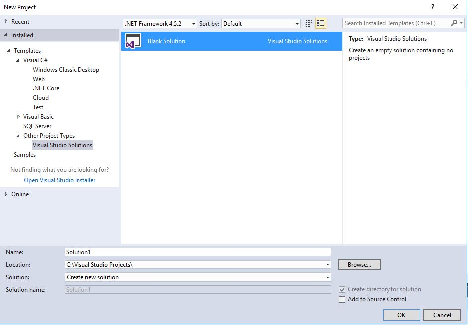
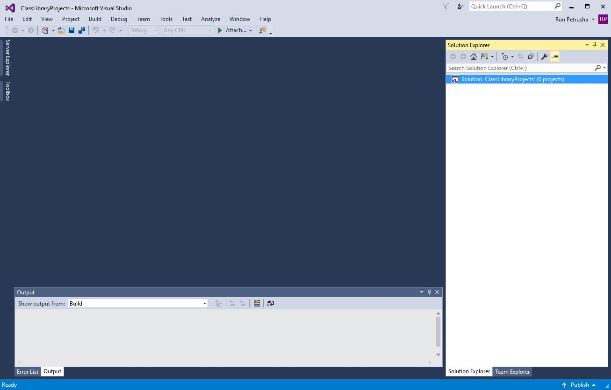
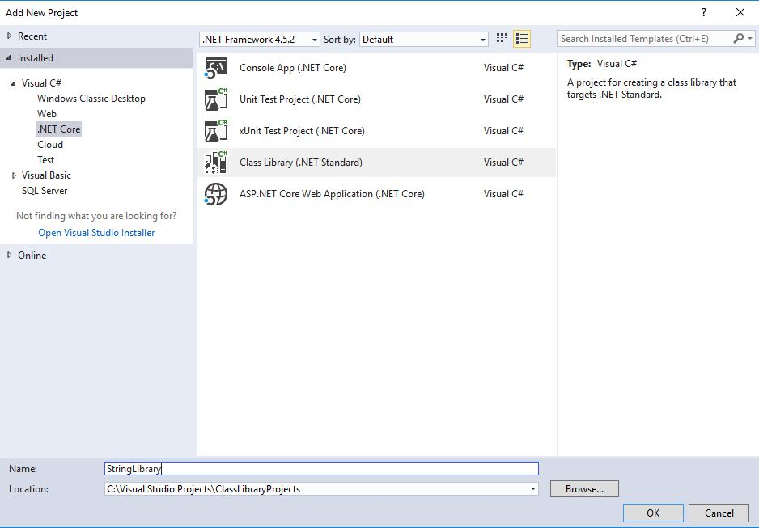
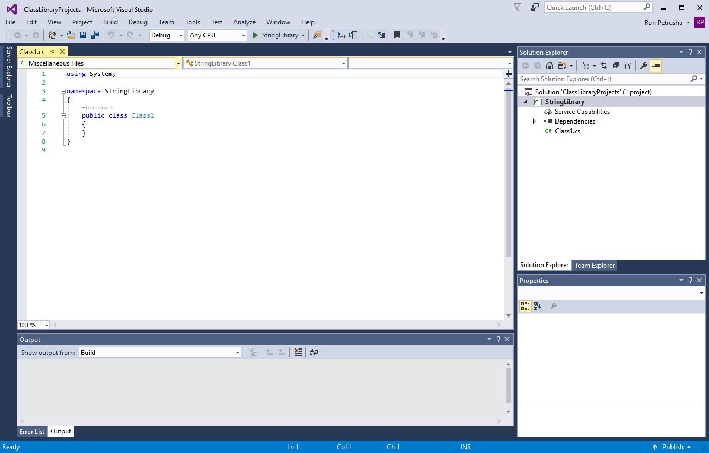

# Building a class library with C# and .NET Core in Visual Studio 2017 RC #

A class library defines types and methods that can be called from any application. A class library developed using .NET Core supports the .NET Standard Library, which allows your library to be called by any .NET platform that supports that version of the .NET Standard Library. When you finish your class library, you can decide whether you want to distribute it as a third-party component, or whether you want to include it as a component that is bundled with one or more applications.

> [!NOTE]
> For a list of the .NET Standard versions and the platforms they support, see [.NET Standard Library](../../standard/library.md).

In this topic, we'll create a simple utility library that contains a single string-handling method. We'll implement it as an [extension method](../../csharp/programming-guide/classes-and-structs/extension-methods.md) so that it can be called as if it were a member of the @System.String class.

## Creating a class library solution ##

Let's start by creating a solution for our class library project and its related projects. A Visual Studio Solution just serves as a container for one or more projects. To create the solution:

1. On the Visual Studio menu bar, choose **File**, **New**, **Project**.

1. In the **New Projects** dialog, expand the **Other Project Types** node, and choose **Visual Studio Solutions**, as the following figure shows.

   

1. Name the solution "ClassLibraryProjects", and choose the **OK** button. The following figure shows the result.

   

## Creating the class library project ##

Now we can create our class library project:

1. In **Solution Explorer**, open the context menu for the **ClassLibraryProjects** node and choose **Add**, **New Project**.

1. In the **Add New Project** dialog, choose the **.NET Core** node, then choose the **Class Library (.NET Standard)** project template.

1. In the **Name** text box, enter "StringLibrary" as the name of the project, as the following figure shows.

   

1. Choose **OK** to create the class library project. The following figure shows the result.

   

1. Replace the code in the code window with the following code:

   [!CODE-csharp[ClassLib#1](../../../samples/snippets/csharp/getting_started/with_visual_studio_2017/classlib.cs#1)]

   The class library, `UtilityLibraries.StringLibrary`, contains a method named `StartsWithUpper`, which returns a @System.Boolean value that indicates whether the current string instance begins with an uppercase character. Which characters are uppercase is defined by the Unicode standard. In .NET Core, the [Char.IsUpper](xref:System.Char.IsUpper(System.Char)) method returns `true` if a character is uppercase.

1. On the menu bar, choose **Build**, **Build Solution**. The project should compile without error.

## The next step ##

So far, we've successfully built the library. But because we haven't called any of its methods, we don't know whether it works as expected. The next step in developing our library is to test it by using a [C# Unit Test Project](testing-library-with-visual-studio.md).

