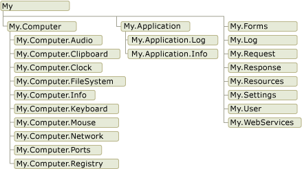

# Development with My (Visual Basic)
Visual Basic provides new features for rapid application development that improve productivity and ease of use while delivering power. One of these features, called `My`, provides access to information and default object instances that are related to the application and its run-time environment. This information is organized in a format that is discoverable through IntelliSense and logically delineated according to use.  
  
 Top-level members of `My` are exposed as objects. Each object behaves similarly to a namespace or a class with `Shared` members, and it exposes a set of related members.  
  
 This table shows the top-level `My` objects and their relationship to each other.  
  
   
  
## In This Section  
 [Performing Tasks with My.Application, My.Computer, and My.User](../../../visual-basic/developing-apps/development-with-my/performing-tasks-with-my-application-my-computer-and-my-user.md)  
 Describes the three central `My` objects, `My.Application`, `My.Computer`, and `My.User`, which provide access to information and functionality  
  
 [Default Object Instances Provided by My.Forms and My.WebServices](../../../visual-basic/developing-apps/development-with-my/default-object-instances-provided-by-my-forms-and-my-webservices.md)  
 Describes the `My.Forms` and `My.WebServices` objects, which provide access to forms, data sources, and XML Web services used by your application.  
  
 [Rapid Application Development with My.Resources and My.Settings](../../../visual-basic/developing-apps/development-with-my/rapid-application-development-with-my-resources-and-my-settings.md)  
 Describes the `My.Resources` and `My.Settings` objects, which provide access to an application's resources and settings.  
  
 [Overview of the Visual Basic Application Model](../../../visual-basic/developing-apps/development-with-my/overview-of-the-visual-basic-application-model.md)  
 Describes the [!INCLUDE[vbprvb](../../../csharp/programming-guide/concepts/linq/includes/vbprvb_md.md)] Application Startup/Shutdown model.  
  
 [How My Depends on Project Type](../../../visual-basic/developing-apps/development-with-my/how-my-depends-on-project-type.md)  
 Gives details on which `My` features are available in different project types.  
  
## See Also  
 <xref:Microsoft.VisualBasic.ApplicationServices.ApplicationBase>   
 <xref:Microsoft.VisualBasic.Devices.Computer>   
 <xref:Microsoft.VisualBasic.ApplicationServices.User>   
 [My.Forms Object](../../../visual-basic/language-reference/objects/my-forms-object.md)   
 [My.WebServices Object](../../../visual-basic/language-reference/objects/my-webservices-object.md)   
 [How My Depends on Project Type](../../../visual-basic/developing-apps/development-with-my/how-my-depends-on-project-type.md)